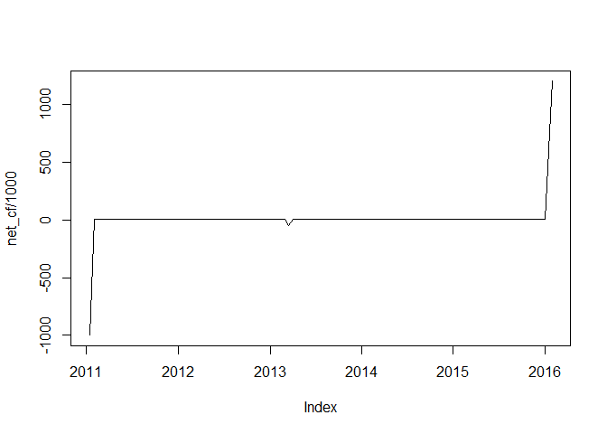
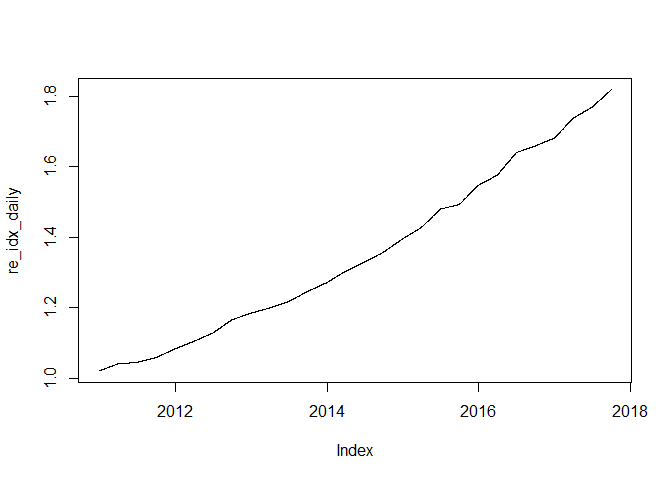

PME methods provide a good way to evaluate real estate investment performance compared to published indices.  Although originally devised for public market comparisons, the method is easily adapted to a real estate context.

GIPS recommends using IRRs to evaluate private market performance.  The question is how do you compare an investment IRR to a to quarterly index.  PME methods provide a good way to calculate an equivalent IRR for the index return that has the same daily money weights as the investment under evaluation.  

The following calculations illustrate how to do this.  


```r
# 
# if you haven't installed the ASRS method package, uncomment the following two lines to install it
# library(devtools)
# install_github("karlp-asrs/asrsMethods/asrsMethods")
#
library(zoo)
```

```
## Warning: package 'zoo' was built under R version 3.5.1
```

```
## 
## Attaching package: 'zoo'
```

```
## The following objects are masked from 'package:base':
## 
##     as.Date, as.Date.numeric
```

```r
library(asrsMethods)
library(lubridate)
```

```
## 
## Attaching package: 'lubridate'
```

```
## The following object is masked from 'package:base':
## 
##     date
```

```r
#
#first let's build a simple real estate project
#assumptions:
#  buy building for $1 million on Jan 13, 2011
#  collect triple net rent at 6% for 3 years then a 5% rent bumpt for next two years
#  fix roof (an exclusion from triple net in your lease) for $50 thousand two years after buying, paid the bill on March 15
#  then sell the building for $1.2 million after 5 year hold, selling on Jan 29, 2016
buy_building=zoo(-1e6,as.Date("2011-1-13"))
nnn_rent=zoo(rep(c(5000,5000*1.05),c(36,24)),as.Date("2011-2-1")+months(0:59))
fix_roof=zoo(-50000,as.Date("2013-3-15"))
sell_building=zoo(1.2e6,as.Date("2016-1-29"))
net_cf=mergesum.z(buy_building,nnn_rent,fix_roof,sell_building)
plot(net_cf/1000)
```

<!-- -->

```r
irr.z(net_cf)
```

```
## [1] 0.08586071
```

OK, so we have a building that made an 8.6% return.   But the cash flow is a little idiosyncratic with odd dates for the entry and exit, a capital expenditure on a particular date and a rent bump part way through.  Now we want to compare this to a real estate index using PME methods to get a good index IRR comparison with the same money weights.  

Here is the code to do that.


```r
#
# first let's invent an index with expected return of 2% per quarter and standard deviation of 1%
re_idx=zoo(rnorm(28,.02,.01),as.Date("2011-1-1")+months(0:27*3)-1)
#
#now we need to turn this in to a daily total return index
re_idx_gd=gd(re_idx) #convert to growth of a dollar 
alldays=as.Date(time(re_idx_gd)[1]:lastinvec(time(re_idx_gd))) #make a vector of all calendar dates from beginning to end of index data
re_idx_daily=merge(re_idx_gd,zoo(NA,alldays))[,1] #create a time series with the known quarterly values and NA for intervening days
re_idx_daily=na.approx(re_idx_daily)  # fill in the NAs using linear interpolation to create a daily total return index
plot(re_idx_daily)
```

<!-- -->

Now all we have to do is use the regular `pestats` function in order to calculate the  pme statistics.


```r
re_pme=pestats(net_cf,re_idx_daily[time(net_cf)])
```

The investment irr is 8.59%    
The index irr (with the same daily cash flows) is 8.2%    
The PME for the investment is 1.02        


